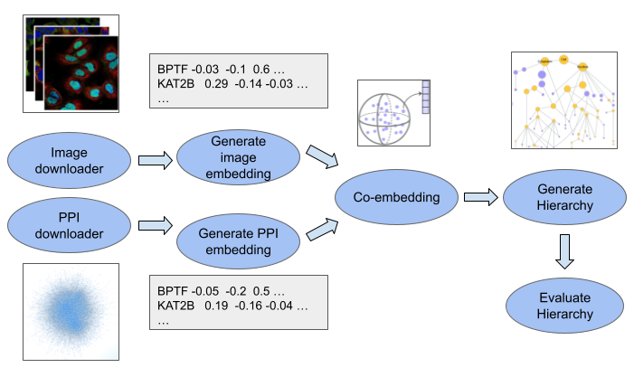

===================
Cell Maps Pipeline
===================

.. image:: https://img.shields.io/pypi/v/cellmaps_pipeline.svg
        :target: https://pypi.python.org/pypi/cellmaps_pipeline

.. image:: https://img.shields.io/travis/idekerlab/cellmaps_pipeline.svg
        :target: https://travis-ci.com/idekerlab/cellmaps_pipeline

The Cell Maps Pipeline takes `ImmunoFluorescent <https://en.wikipedia.org/wiki/Immunofluorescence>`__ images from
the `Human Protein Atlas <https://www.proteinatlas.org>`__ along with
`Affinity Purification Mass Spectrometry <https://www.thermofisher.com/us/en/home/industrial/mass-spectrometry/proteomics-protein-mass-spectrometry/proteomics-protein-mass-spectrometry-workflows/protein-structure-analysis-mass-spectrometry/affinity-mass-spectrometry.html>`__
data from one or more sources, converts them into embeddings that
are then coembedded and converted into an integrated interaction network from which a hierarchical
model is derived.

The pipeline invokes six tools that each create an output directory where results are
stored and registered within `Research Object Crates (RO-Crate) <https://www.researchobject.org/ro-crate>`__ using
the `FAIRSCAPE-cli <https://pypi.org/project/fairscape-cli>`__.

Overview of Cell Maps Pipeline

..
    The pipeline_overview.png image is from this google doc: https://docs.google.com/drawings/d/1pAqQkmg8hRh7ySkgu5PVY7Hu4pwMyejAzAYzGge0ilU/edit

* Free software: MIT license

.. toctree::
   :maxdepth: 2
   :caption: Contents:

   installation
   usage
   modules
   developer
   authors
   history

Indices and tables
==================
* :ref:`genindex`
* :ref:`modindex`
* :ref:`search`
