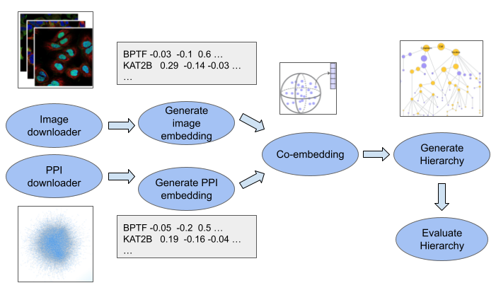
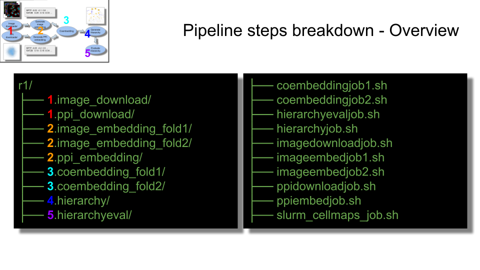
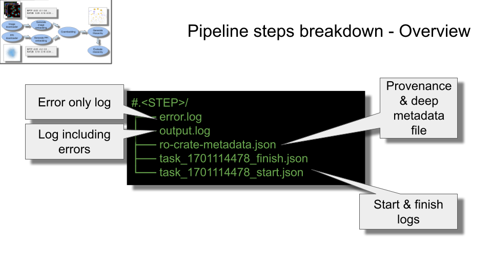
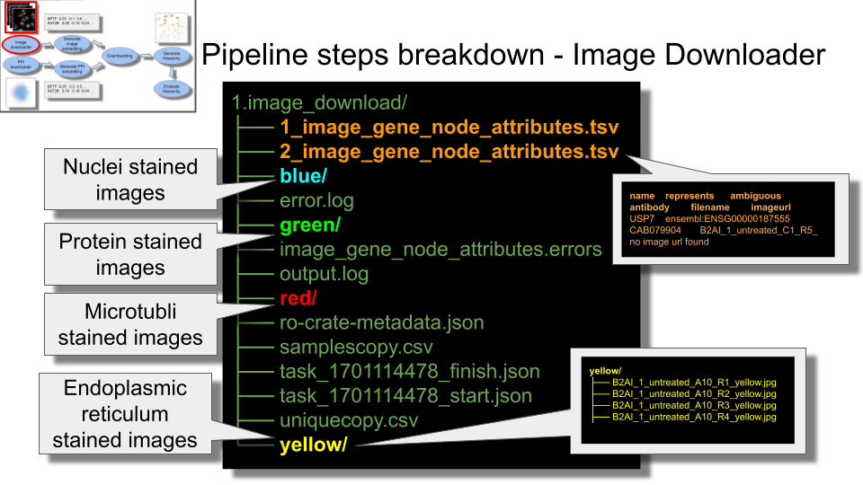
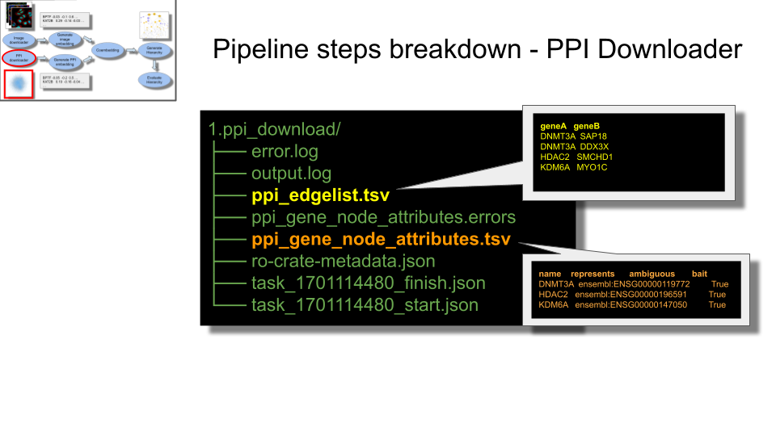
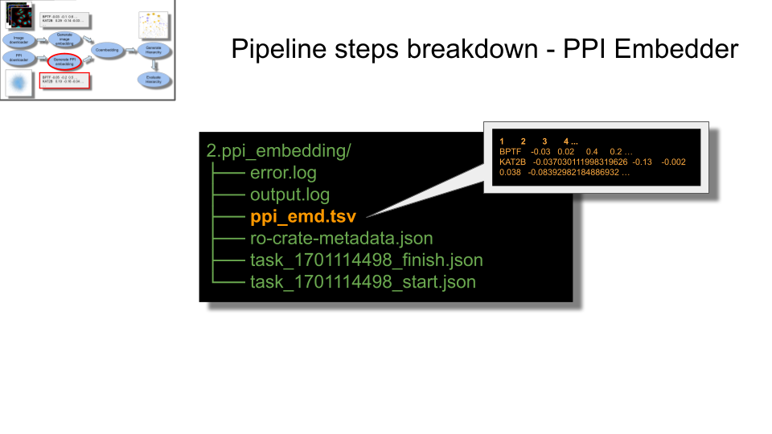
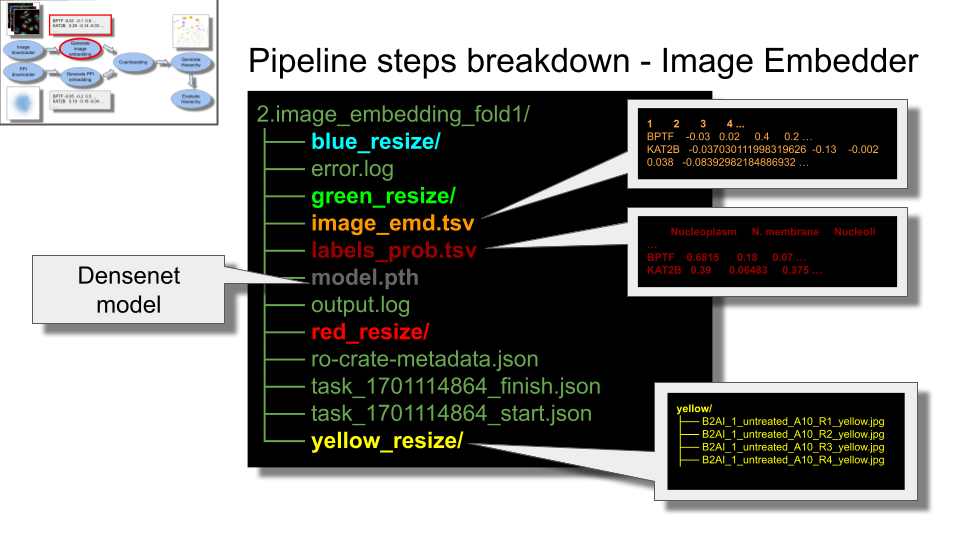
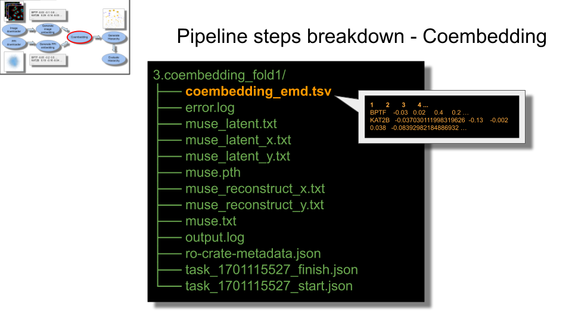
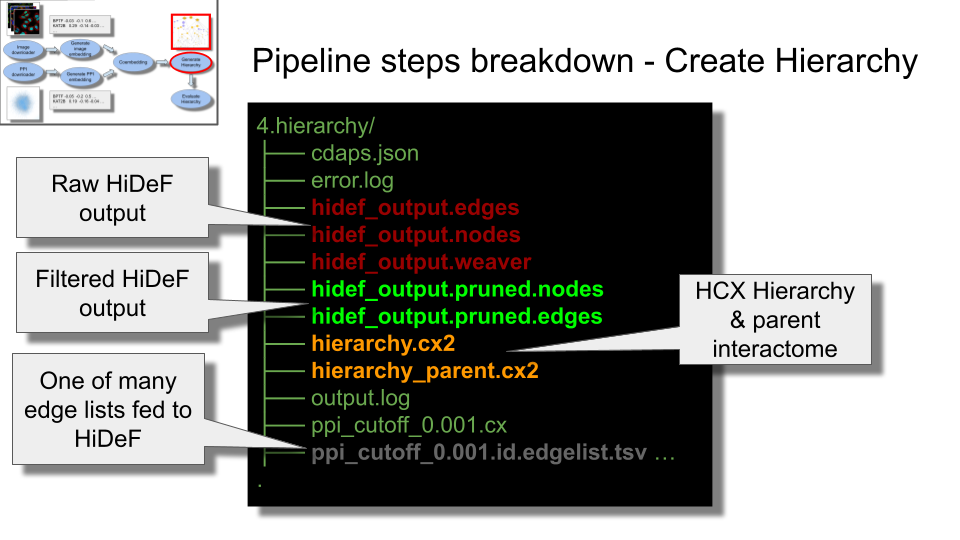
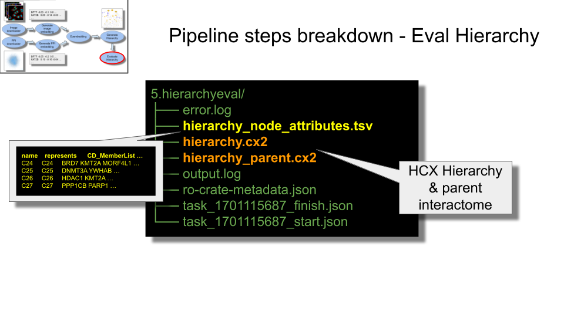

===========
Outputs
===========

This pipeline tool creates several directories in the specified output directory.
Below is a list and description of these output directories with links to more
detailed information.

..
    The pipeline_overview.png image is from this google doc: https://docs.google.com/drawings/d/1pAqQkmg8hRh7ySkgu5PVY7Hu4pwMyejAzAYzGge0ilU/edit
    The other images are from https://docs.google.com/presentation/d/1l5P4n_h-GZUkAGvJIrUZ5zP60HKXzOsbVRQ7ZtjSRhc/edit#slide=id.p

When run via `SLURM`_ the following directories and files are created:

Within each directory are some common files:

* **1.image_download**

  Output from `cellmaps_imagedownloader, <https://cellmaps-imagedownloader.readthedocs.io>`__
  for more information on output `click here <https://cellmaps-imagedownloader.readthedocs.io/en/latest/outputs.html>`__

* **1.ppi_download**

  Output from `cellmaps_ppidownloader, <https://cellmaps-ppidownloader.readthedocs.io>`__
  for more information on output `click here <https://cellmaps-ppidownloader.readthedocs.io/en/latest/outputs.html>`__

* **2.ppi_embedding**

  Output from `cellmaps_ppi_embedding, <https://cellmaps-ppi-embedding.readthedocs.io>`__
  for more information on output `click here <https://cellmaps-ppi-embedding.readthedocs.io/en/latest/outputs.html>`__

* **2.image_embedding_fold#**

  Output from `cellmaps_image_embedding, <https://cellmaps-image-embedding.readthedocs.io>`__
  for more information on output `click here <https://cellmaps-image-embedding.readthedocs.io/en/latest/outputs.html>`__

* **3.coembedding_fold#**

  Output from `cellmaps_coembedding, <https://cellmaps-coembedding.readthedocs.io>`__
  for more information on output `click here <https://cellmaps-coembedding.readthedocs.io/en/latest/outputs.html>`__

* **4.hierarchy**

  Output from `cellmaps_generate_hierarchy, <https://cellmaps-generate-hierarchy.readthedocs.io>`__
  information on output `click here <https://cellmaps-generate-hierarchy.readthedocs.io/en/latest/outputs.html>`__

* **5.hierarchyeval**

  Output from `cellmaps_generate_hierarchy, <https://cellmaps-hierarchyeval.readthedocs.io>`__
  information on output `click here <https://cellmaps-hierarchyeval.readthedocs.io/en/latest/outputs.html>`__

.. _CM4AI data: https://cm4ai.org/data
.. _RO-Crate: https://www.researchobject.org/ro-crate/
.. _Human Protein Atlas: https://www.proteinatlas.org
.. _Bioplex: https://bioplex.hms.harvard.edu
.. _cellmaps_pipeline: https://github.com/idekerlab/cellmaps_pipeline
.. _JSON: https://www.json.org/json-en.html
.. _SLURM: https://slurm.schedmd.com/documentation.html
